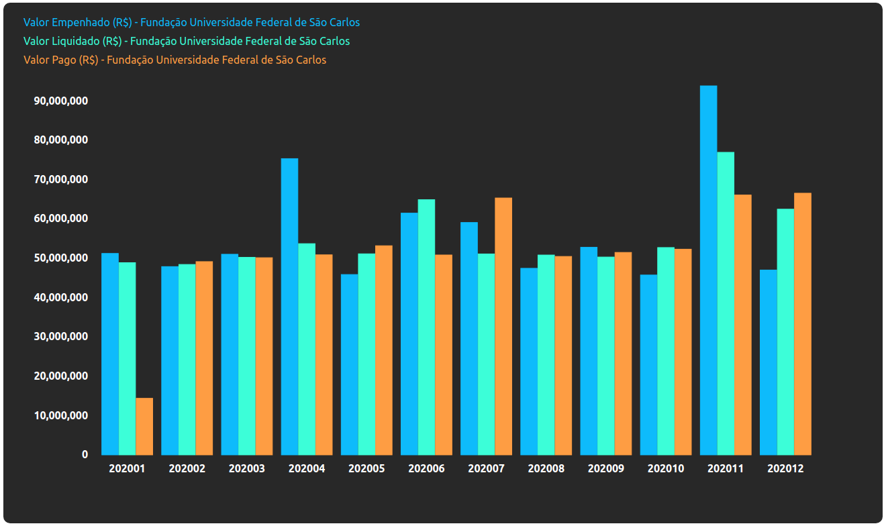

# Govdata - "Portal da Transparência" data collector.

Data collector from Brazil government open reports.

## Back-end

All Back-end is built using Python, Flask and MongoDB. Software Back-end collect some reports from "Portal da Trasparência" as CSV, process and save the data at a MongoDB instance.

The Back-end also has an API to export the data saved.

## Front-end

All Front-end is built with React. For now, the Front-end just let the user consult some investments from Brazil government to some other institutions, like Universities and Army.

