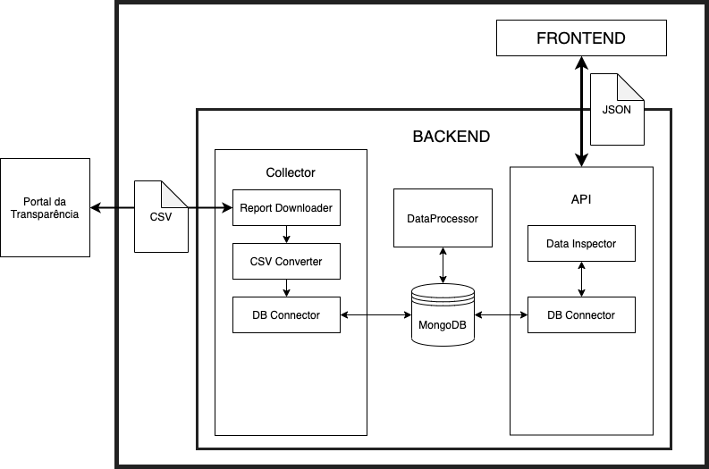

# BR Data Inspector - "Portal da Transparência" data collector and Analyzer

## About

The BR Data Collector is designed to collect data from Brazil's "Portal da Transparência", which is a portal
full of data from Brazil government, like expenses, contracts, payrolls, etc.

The main objective of this projects is provide a easy to use and easy to search interface, where users can
check how the government institutions expend the money, what contracts were signed and more details about
investments.

The project is currently available at [brdata.site](https://brdata.site)

## How to run

### Development environment

To run the backend (data collector and API), please visit the [backend folder page](backend)

To run the frontend, just run `npm install` and `npm start`. Just make sure that the `frontend/br_data_inspector` folder contains a `.env` file.

## How to add more months

To add more months to the system and collect new reports, the following data sctructures must be changed:

### Backend task_list:

Months are passed as args to the URL request. So new args must be added to `tasks_list.json` file, in the backend folder.

### Frontend MonthPicker:

Users should be able to select the new months at the Home screen month selector. New options can be added at the `Home/MonthPicker.js` file.

### Frontend DataSummary:

The Data summary card must show the name of the Months that were searched. To show the month name, the `DataPage/DataSummary.js` file must be updated.

That's it! Don't forget to test it, collect data and recreate the ranking lists.
