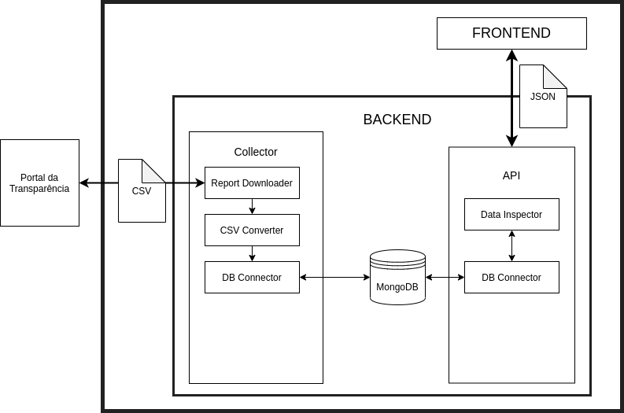
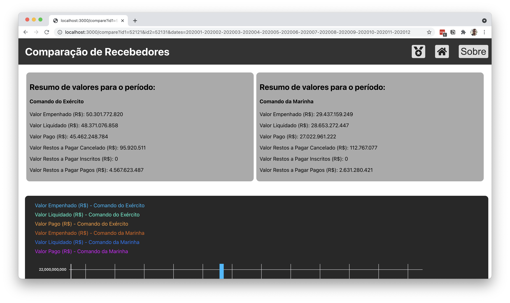

# BR Data Inspector - "Portal da Transparência" data collector and Analyzer

Data collector from Brazil government open reports.

## Back-end

All Back-end is built using Python, Flask and MongoDB. Software back-end collect some reports from "Portal da Trasparência" as CSV, process and save the data at a MongoDB instance.

The back-end has a routine called DataProcessor, that is responsible for processing some data collected and creating some lists inside Redis DB, as Entities list and Receivers rank.

The Back-end also has an API to export the data saved.

## Front-end

All Front-end is built with React. For now, the Front-end just let the user consult some investments from Brazil government to some other institutions, like Universities and Army.

# How to run it

## Pre-requisites

Softwares needed for the application:

### Databases

This softwares runs using **Python 3.8** and **NPM 7.21**.

**MongoDB**

Linux (apt):

    sudo apt install mongodb-server

MacOS (homebrew):

    brew install mongodb-community

**Redis DB**

Linux (apt):

    sudo apt install redis-server
You may want to take a look on how to setup Redis as a systemctl service.

MacOS (homebrew):

    brew install redis

### Run (development enviroment)

As a softwares that is currently being developed,the software does not have a production environment.

To run the back-end, simply run the *run.py* file.

MAKE SURE YOU ARE USING THE ENV WITH REQUIREMENTS INSTALLED!

To collect data from "Portal da Transparência", run:

    python run.py --collect

To run the DataProcessor routine and create sime acche listing, run:

    python run.py --update