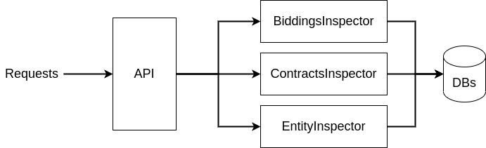

### Data Inspector Module

The DataInspector module is the interface between requests and the Databases. All queries and data search should be done by this Module.

This is very different from the DataProcessor idea and usage.

#### Classes inside

**BiddingsInspector**

All search for Biddings, queries and filtering should be done by this class. The API routes will call methods inside this class to retrieve
data from the Biddings databases and collections.

**ContractsInspector**

All search for Contracts, queries and filtering should be done by this class. The API routes will call methods inside this class to retrieve
data from the Contracts databases and collections.

**EntityInspector**

All search for Entities, queries and filtering should be done by this class. The API routes will call methods inside this class to retrieve
data from the Entities databases and collections.

